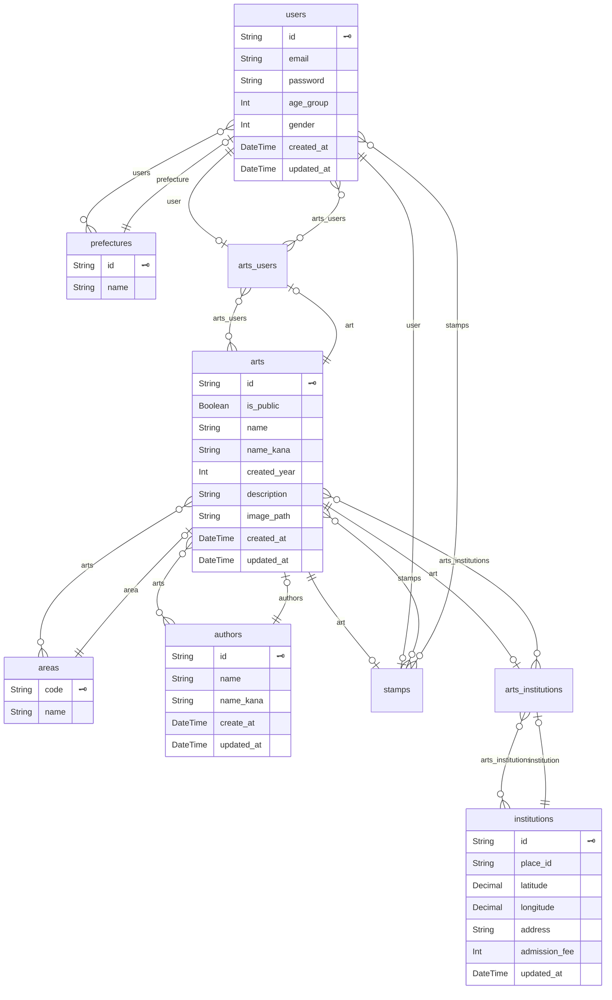

```mermaid
erDiagram

  "users" {
    String id "🗝️"
    String email 
    String password 
    Int age_group 
    Int gender 
    DateTime created_at 
    DateTime updated_at 
    }
  

  "prefectures" {
    String id "🗝️"
    String name 
    }
  

  "areas" {
    String code "🗝️"
    String name 
    }
  

  "institutions" {
    String id "🗝️"
    String place_id 
    Decimal latitude 
    Decimal longitude 
    String address 
    Int admission_fee 
    DateTime updated_at 
    }
  

  "arts" {
    String id "🗝️"
    Boolean is_public 
    String name 
    String name_kana 
    Int created_year 
    String description 
    String image_path 
    DateTime created_at 
    DateTime updated_at 
    }
  

  "authors" {
    String id "🗝️"
    String name 
    String name_kana 
    DateTime create_at 
    DateTime updated_at 
    }
  

  "stamps" {

    }
  

  "arts_institutions" {

    }
  

  "arts_users" {

    }
  
    "users" o|--|| "prefectures" : "prefecture"
    "users" o{--}o "arts_users" : "arts_users"
    "users" o{--}o "stamps" : "stamps"
    "prefectures" o{--}o "users" : "users"
    "areas" o{--}o "arts" : "arts"
    "institutions" o{--}o "arts_institutions" : "arts_institutions"
    "arts" o|--|| "areas" : "area"
    "arts" o{--}o "arts_institutions" : "arts_institutions"
    "arts" o{--}o "arts_users" : "arts_users"
    "arts" o{--}o "stamps" : "stamps"
    "arts" o|--|| "authors" : "authors"
    "authors" o{--}o "arts" : "arts"
    "stamps" o|--|| "users" : "user"
    "stamps" o|--|| "arts" : "art"
    "arts_institutions" o|--|| "arts" : "art"
    "arts_institutions" o|--|| "institutions" : "institution"
    "arts_users" o|--|| "arts" : "art"
    "arts_users" o|--|| "users" : "user"
```
