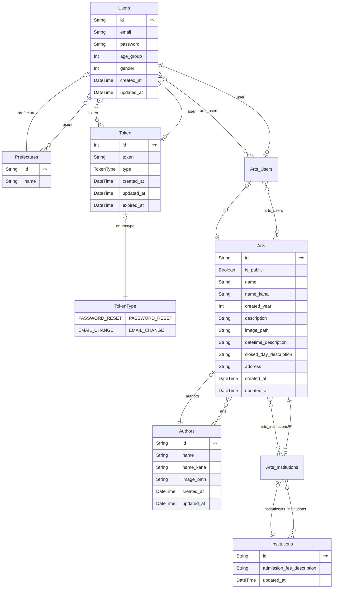

```mermaid
erDiagram

        TokenType {
            PASSWORD_RESET PASSWORD_RESET
EMAIL_CHANGE EMAIL_CHANGE
        }
    
  "Users" {
    String id "🗝️"
    String email 
    String password 
    Int age_group 
    Int gender 
    DateTime created_at 
    DateTime updated_at 
    }
  

  "Prefectures" {
    String id "🗝️"
    String name 
    }
  

  "Institutions" {
    String id "🗝️"
    String admission_fee_description 
    DateTime updated_at 
    }
  

  "Arts" {
    String id "🗝️"
    Boolean is_public 
    String name 
    String name_kana 
    Int created_year 
    String description 
    String image_path 
    String datetime_description 
    String closed_day_description 
    String address 
    DateTime created_at 
    DateTime updated_at 
    }
  

  "Authors" {
    String id "🗝️"
    String name 
    String name_kana 
    String image_path 
    DateTime created_at 
    DateTime updated_at 
    }
  

  "Arts_Institutions" {

    }
  

  "Arts_Users" {

    }
  

  "Token" {
    Int id "🗝️"
    String token 
    TokenType type 
    DateTime created_at 
    DateTime updated_at 
    DateTime expired_at 
    }
  
    "Users" o|--|| "Prefectures" : "prefecture"
    "Users" o{--}o "Arts_Users" : "arts_users"
    "Users" o{--}o "Token" : "token"
    "Prefectures" o{--}o "Users" : "users"
    "Institutions" o{--}o "Arts_Institutions" : "arts_institutions"
    "Arts" o{--}o "Arts_Institutions" : "arts_institutions"
    "Arts" o{--}o "Arts_Users" : "arts_users"
    "Arts" o|--|| "Authors" : "authors"
    "Authors" o{--}o "Arts" : "arts"
    "Arts_Institutions" o|--|| "Arts" : "art"
    "Arts_Institutions" o|--|| "Institutions" : "institution"
    "Arts_Users" o|--|| "Arts" : "art"
    "Arts_Users" o|--|| "Users" : "user"
    "Token" o|--|| "TokenType" : "enum:type"
    "Token" o|--|| "Users" : "user"
```
